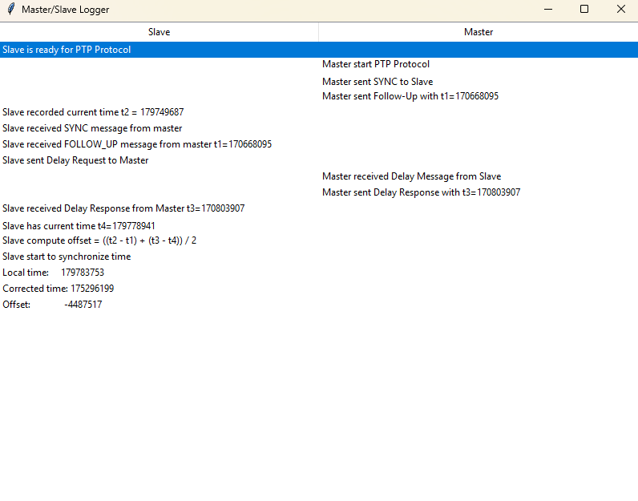

# Time Synchronization Project (PTP Protocol)

This project implements a **Precision Time Protocol (PTP)** simulation using Python and ESP32 devices. It includes a **GUI to visualize messages** between master and slave, as well as test scripts for each PTP node.

---

## 📂 Project Structure

```
Time_Synchronization/
│
├── main.py                # Main GUI application
├── PTP_Server/            # Master PTP firmware (PlatformIO project)
├── PTP_Slave/             # Slave PTP firmware (PlatformIO project)
├── tests/                 # Python scripts to test PTP protocol
├── README.md              # This file
└── images/                # Screenshots or diagrams for README
```

---

## ⚙️ Requirements

- Python 3.11+
- Tkinter (for GUI)
- PlatformIO (for ESP32 firmware)

Install Tkinter on Ubuntu/Debian:

```bash
sudo apt install python3-tk
```

---

## 🗑️ Usage

### 1️⃣ Run GUI

```bash
python main.py -slave <slave_ip> -master <master_ip>
```

- `-slave` → IP of the slave device
- `-master` → IP of the master device

The GUI shows messages in **two columns**:

- **Left column** → Slave messages
- **Right column** → Master messages

Example GUI:



---

### 2️⃣ Run Tests

Test the PTP protocol with each node:

```bash
# Master on COM3
python tests/testMaster.py

# Slave on COM5
python tests/testSlave.py
```

These scripts simulate message exchange and log timestamps.

---

### 3️⃣ ESP32 Firmware

- `PTP_Server/` → Flash the master PTP node via PlatformIO (COM3).
- `PTP_Slave/` → Flash the slave PTP node via PlatformIO (COM5).

---

## 📌 Features

- Master/Slave PTP simulation
- Real-time GUI logging
- Separate test scripts for each node
- Cross-platform (Windows, Linux, MacOS)

---

## 🧰 Notes

- Ensure **all devices are on the same network**.
- UDP packets must not be blocked by firewalls.
- The GUI **auto-updates** when messages are received.

---

## 🔗 References

- [Precision Time Protocol (PTP) - IEEE 1588](https://en.wikipedia.org/wiki/Precision_Time_Protocol)
- [PlatformIO Documentation](https://docs.platformio.org/)
